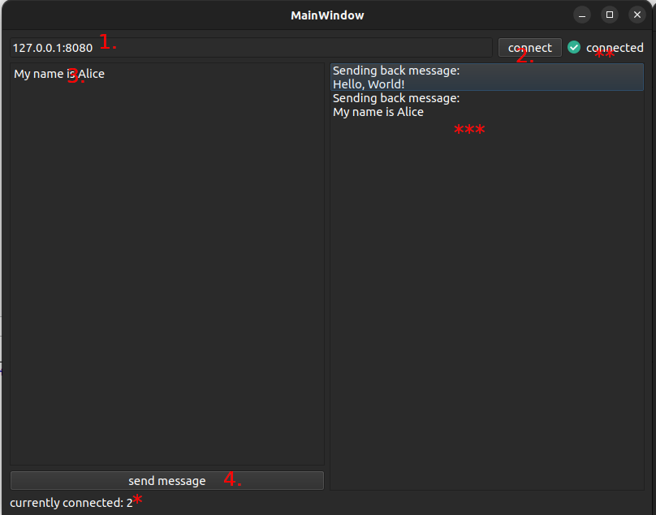

# Qt TCP Client-Server Application

A Qt-based TCP client-server application that demonstrates network communication between a GUI client and a command-line server.

## Table of Contents

- [Project Structure](#project-structure)
- [Features](#features)
  - [Client Application (GUI)](#client-application-gui)
  - [Server Application (Command Line)](#server-application-command-line)
- [Prerequisites](#prerequisites)
- [Building the Project](#building-the-project)
  - [Using Qt Creator](#using-qt-creator)
  - [Alternative: Command Line Build (Advanced)](#alternative-command-line-build-advanced)
- [Usage](#usage)
  - [Starting the Server](#starting-the-server)
  - [Running the Client](#running-the-client)
- [Quick Start Guide](#quick-start-guide)
  - [Step-by-Step Usage](#step-by-step-usage)
  - [Interface Elements](#interface-elements)
- [Protocol](#protocol)
- [Technical Details](#technical-details)
  - [Client Implementation](#client-implementation)
  - [Server Implementation](#server-implementation)
  - [Network Architecture](#network-architecture)
- [Development Notes](#development-notes)
- [Troubleshooting](#troubleshooting)
  - [Common Issues](#common-issues)
  - [Debugging](#debugging)
- [License](#license)

## Project Structure

```
qt-assignment/
├── app/                    # Qt GUI Client Application
│   ├── main.cpp           # Client application entry point
│   ├── mainwindow.h/.cpp  # Main window class with GUI
│   ├── mainwindow.ui      # Qt Designer UI file
│   ├── pkg/tcp/           # TCP client implementation
│   │   ├── tcpclient.h    # TCP client header
│   │   └── tcpclient.cpp  # TCP client implementation
│   ├── resoursec.qrc      # Qt resource file (images)
│   └── CMakeLists.txt     # Client build configuration
└── server/                # TCP Server Application
    ├── main.cpp           # Server application entry point
    ├── server.cpp         # Server logic
    ├── tcpserver.h/.cpp   # TCP server implementation
    └── CMakeLists.txt     # Server build configuration
```

## Features

### Client Application (GUI)
- **Graphical User Interface**: Built with Qt Widgets
- **Connection Management**: Connect to server with host and port
- **Message Sending**: Send custom messages to the server
- **Status Monitoring**: Visual connection status indicator (green/red circle)
- **Automatic Status Checking**: Periodic status checks every 5 seconds
- **Real-time Response**: Displays server responses in the GUI

### Server Application (Command Line)
- **Multi-client Support**: Handles multiple concurrent connections
- **Configurable Port**: Set custom port via command line
- **Configurable Max Clients**: Set maximum number of concurrent clients
- **Message Echo**: Echoes received messages back to clients
- **Status Command**: Special "status" command for connection health checks
- **Signal Handling**: Proper SIGPIPE handling for robust operation

## Prerequisites

- **Qt Creator** (with Qt 5 or Qt 6 support)
- **Qt 5 or Qt 6** (Widgets and Core modules)
- **CMake 3.16+** (automatically handled by Qt Creator)
- **C++17 compatible compiler**
- **Linux/Unix system** (uses POSIX sockets)

## Building the Project

This project is designed to be built using **Qt Creator**. The project includes CMakeLists.txt files that are configured to work seamlessly with Qt Creator's build system.

### Using Qt Creator

1. **Open the Project**:
   - Launch Qt Creator
   - Open the project by selecting `File → Open File or Project`
   - Navigate to either `app/CMakeLists.txt` or `server/CMakeLists.txt`
   - Qt Creator will automatically detect and configure the CMake project

2. **Configure the Project**:
   - Qt Creator will prompt you to configure the project
   - Select your desired Qt version and compiler
   - Choose the build directory (default: `build/`)

3. **Build the Project**:
   - Use `Ctrl+B` or click the Build button
   - Or use `Build → Build Project` from the menu

### Alternative: Command Line Build (Advanced)

If you prefer to build from the command line, you can use CMake directly:

#### Build Client Application
```bash
cd app
mkdir build && cd build
cmake ..
make
```

#### Build Server Application
```bash
cd server
mkdir build && cd build
cmake ..
make
```

## Usage

### Starting the Server

```bash
# Basic usage with default settings
./server

# Specify custom port and max clients
./server -p 8080 -m 10

# Show help
./server --help
```

**Command Line Options:**
- `-p <port>`: TCP port to listen on (default: 8080)
- `-m <max_clients>`: Maximum number of concurrent clients (default: 100)
- `--help`: Show help message
- `--version`: Show version information

### Running the Client

```bash
# Run the GUI client
./app
```

**Client Features:**
1. **Connect**: Enter server host and port, then click "Connect"
2. **Send Message**: Type a message and click "Send Message"
3. **Status Indicator**: Green circle = connected, Red circle = disconnected
4. **Response Display**: Server responses appear in the response area

## Protocol

The application uses a simple text-based protocol:

- **Client → Server**: Any text message
- **Server → Client**: Echo of the message with prefix "Sending back message:\n"
- **Status Check**: Client sends "status" message every 5 seconds
- **Server Response to Status**: Server acknowledges the status check

## Technical Details

### Client Implementation
- **Qt Framework**: Uses Qt Widgets for GUI
- **Threading**: Background thread for status checking
- **TCP Client**: Custom TCP client implementation using POSIX sockets
- **Resource Management**: Qt resource system for embedded images

### Server Implementation
- **Multi-threading**: Separate thread for accepting new connections
- **Client Management**: Vector-based client connection tracking
- **Polling**: Uses `poll()` for efficient I/O multiplexing
- **Signal Handling**: Proper SIGPIPE handling for network robustness

### Network Architecture
- **Protocol**: TCP/IP
- **Socket Type**: Stream sockets (SOCK_STREAM)
- **Address Family**: IPv4 (AF_INET)
- **Keep-alive**: TCP keep-alive options enabled

## Development Notes

- **C++ Standard**: C++17
- **Thread Safety**: Uses mutex for client list protection
- **Error Handling**: Comprehensive error checking and reporting
- **Memory Management**: RAII principles with smart pointers where appropriate
- **Cross-platform**: Designed for Linux/Unix systems

## Troubleshooting

### Common Issues

1. **Port Already in Use**
   ```
   Error: Address already in use
   ```
   Solution: Use a different port with `-p` option

2. **Connection Refused**
   - Ensure server is running before starting client
   - Check firewall settings
   - Verify host and port are correct

3. **Build Errors**
   - Ensure Qt Creator and Qt development packages are installed
   - Check that the correct Qt version is selected in Qt Creator
   - Verify C++17 compiler support
   - If using command line build, ensure CMake version compatibility

### Debugging

- Server logs all received messages to stdout
- Client displays connection status in GUI
- Use `netstat -tlnp` to check if server is listening on expected port

## Quick Start Guide



### Step-by-Step Usage

1. **Configure Connection**: Set your server IP address and port number
2. **Establish Connection**: Click the "Connect" button to connect to the server
3. **Send Messages**: Type your message in the input field and click "Send Message"
4. **Monitor Status**: Watch the connection status indicator and server responses

### Interface Elements

- **Connection Status Indicator**: 
  - 🟢 Green circle = Connected to server
  - 🔴 Red circle = Disconnected from server
- **User Counter**: Shows the number of currently connected users
- **Response Area**: Displays server responses and echo messages
